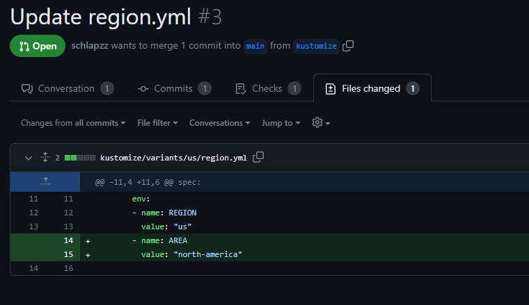
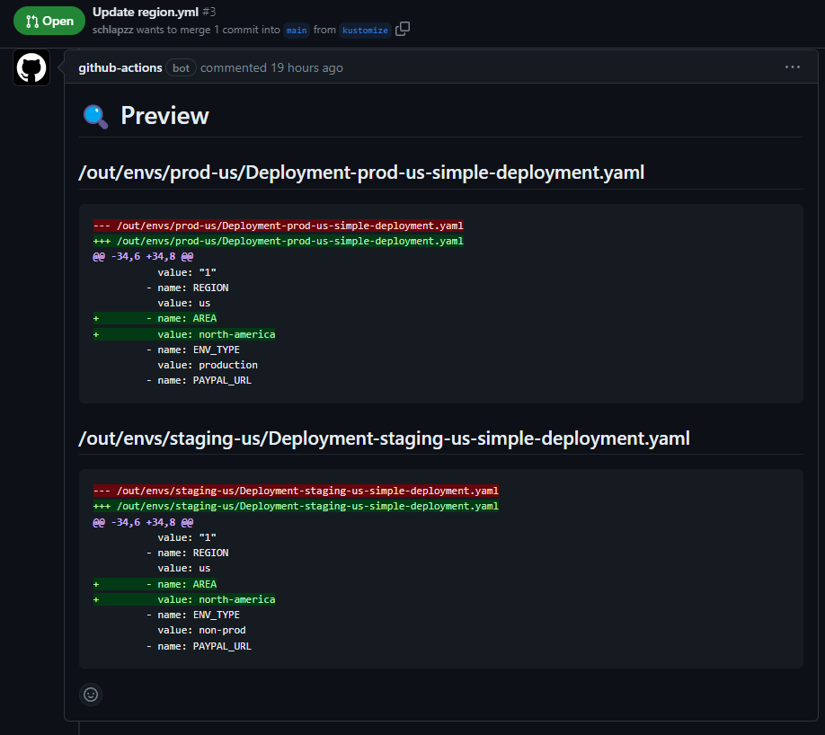
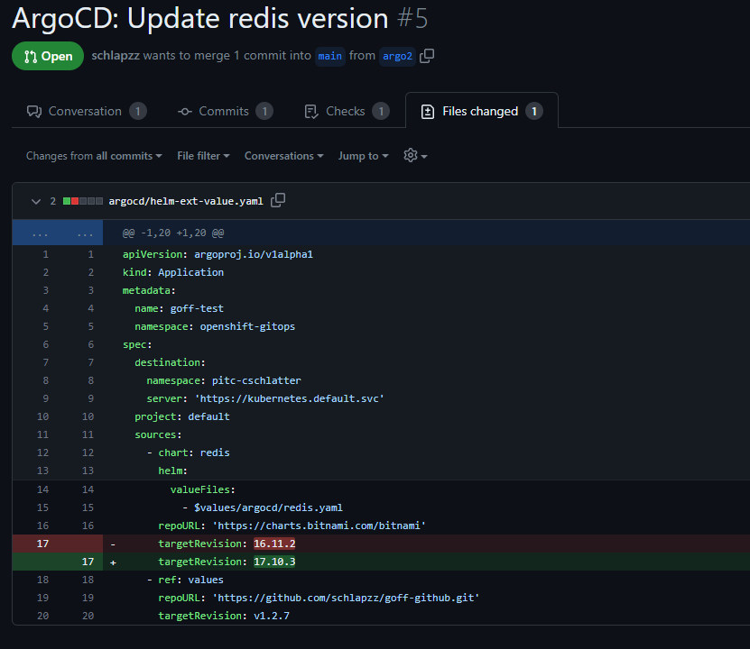
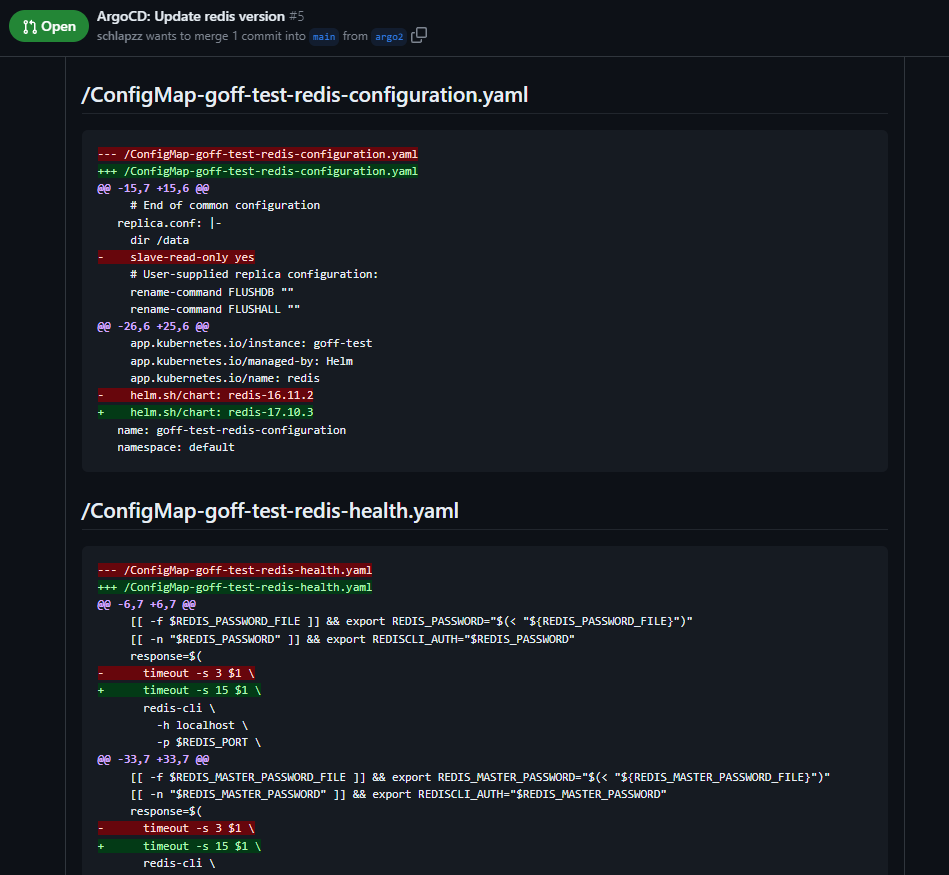

# GOFF

Inspired from Kostis Kapelonis (Codefresh.io) talk at the KubeCon about [How to Preview and Diff Your Argo CD Deployments](https://youtu.be/X392bJX0AEs) we relased our own GitOps Diff tool (Goff). This tool helps you to preview your changes in your GitOps Repository.

## How it works

[Checkout the examples](doc/)

### Kustomize example

1. Create a new branch and commit your changes in your Kustomize deployment
 
2. Run your pipeline, Goff renders the Base and the Overlays and calculate the diff between the source and target branch.
3. Check the auto generated comment in your Pull request and review the changes
 

### ArgoCD Application

1. Create a new branch and commit your changes in your ArgoCd Application
 
2. Run your pipeline, Goff renders the Appication into manifests calculate the diff between the source and target branch.
3. Check the auto generated comment in your Pull request and review the changes
 

## Usage

```bash
Helper tool to show changes between .....

Usage:
  goff [command]

Available Commands:
  argocd      Render manifests from ArgoCD Application
  completion  Generate the autocompletion script for the specified shell
  diff        Diff files [sourceDir] [targetDir]
  help        Help about any command
  kustomize   Generate a DOT file to visualize the dependencies betw

Flags:
  -h, --help     help for goff
  
  -t, --toggle   Help message for toggle

Use "goff [command] --help" for more information about a command.
```

## Supported Tools

| Tooling               | Support                                       |
|-----------------------|----------------------------------------------|
| Plain manifests       | ✅                                          |
| Helm                  | ✅ Supported through plain manifests        |
| Kustomize             | ✅                                          |
| ArgoCD Application    | ✅ Needs a local ArgoCD Repo server instance             |
| ArgoCD ApplicationSet |  🚧 Not yet supported                       |

## Build

### Build binary from source

```bash
go build -o goff goff 
```

### Build Image with dagger

```bash
export REGISTRY_PASSWORD=....
export REGISTRY_USER=....
go run ci/main.go 
```

If you wanna try the new fancy Dagger TUI

```bash
export _EXPERIMENTAL_DAGGER_TUI=1
export REGISTRY_PASSWORD=....
export REGISTRY_USER=....
dagger run go run ci/main.go
```
